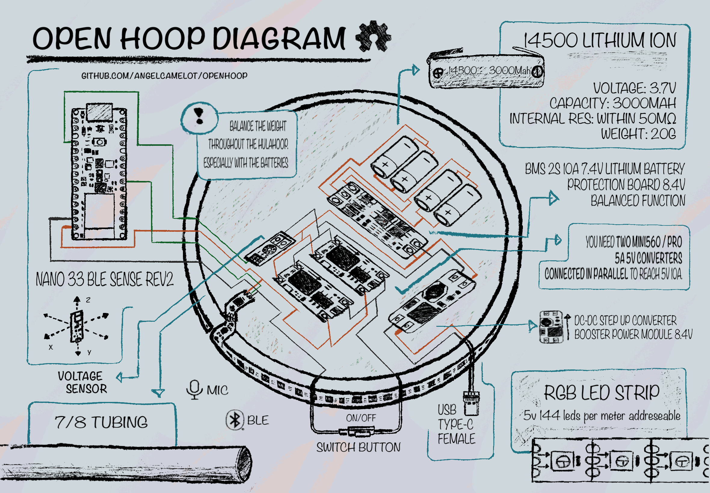

# OpenHoop

## Table of Contents

- [Overview](#overview)
- [Features](#features)
- [Hardware Requirements](#hardware-requirements)
- [Software Requirements](#software-requirements)
- [Installation](#installation)
- [Usage](#usage)
- [BLE Commands](#ble-commands)
- [Troubleshooting](#troubleshooting)
- [TODOs](#todos)
- [Contributing](#contributing)
- [License](#license)

## Overview

OpenHoop revolutionizes hula hooping by merging cutting-edge LED effects, advanced Bluetooth connectivity, including HID (Human Interface Device) protocol, and energy-saving features. It's a canvas for creative expression, empowering users to craft mesmerizing performances with pixel-perfect LED artistry. With seamless Bluetooth control and an open-source ethos, OpenHoop fosters collaboration and innovation within the community.

## Features

- **Versatile Effect Utilities:** Access sound levels, gyroscope readings, and more to enhance LED effects' flexibility.
- **Pixel Art LED Images:** Display visually striking pixel art images as part of LED effects.
- **Diverse LED Effects:** Choose from a library of pre-built LED effects or create custom patterns.
- **Bluetooth Connectivity:** Control LED effects via Bluetooth using a mobile app, leveraging BLE HID protocol.
- **Energy-Saving Mode:** Optimize battery usage with customizable energy-saving levels for extended performances.

## Hardware Requirements

### Microcontroller, Power Supply, LED and Connectivity
- Arduino Nano 33 BLE Sense Rev2
- x2 High-Efficiency Output 5V 5A Mini560 Step-Down DC-DC Converters
- x6 3000mAh 14500 3.7V Rechargeable Li-Ion Batteries
- 7.4V 8.4V 2S BMS PCM Charge/Discharge Protection Board
- Voltage Tester Sensor Measurement Detection Module
- DC-DC Step-Up Converter Booster Power Module
- Adafruit NeoPixel LED Strip (2 meters, 144 LEDs per meter)
- USB 3.1 Type-C Connector (24 Pins Female Plug Socket)
- Assorted Cables and Connectors
- Male and Female Butt Socket Electric Motorcycle Wire Connector (optional)

### Hula Hoop Components
- HDPE Tubing (7/8 inch, 2 meters)
- Polypro Connector for Tubing (7/8 inch)
- Stainless Steel Paddle Spring Buckle

### Additional Tools and Materials
- Basic Hand Tools
- Soldering Iron (optional, for advanced assembly)

### Hula Hoop System Diagram

**A visual representation of the hardware components and their connections can be found [here](DIAGRAM.png).**

## Software Requirements

- PlatformIO

## Dependencies

- [Adafruit NeoPixel Library](https://github.com/adafruit/Adafruit_NeoPixel)
- [ArduinoBLE Library](https://github.com/arduino-libraries/ArduinoBLE)
- [PDM Library](https://github.com/arduino-libraries/PDM)

## Installation

1. **Clone this repository:** `git clone https://github.com/angelcamelot/OpenHoop.git`
2. **Open the `OpenHoop` folder in PlatformIO.**
3. **Install the required libraries using the PlatformIO Library Manager.**
4. **Connect your hardware and upload the code to your microcontroller.**

## Usage

Follow these steps to set up and use OpenHoop for your hula hoop performances:

1. **Power on the Hula Hoop.**
2. **Connect to the OpenHoop BLE device using a compatible mobile app.**
3. **Customize LED effects, colors, and energy-saving settings.**
4. **Enjoy the mesmerizing light display during your hula hoop performance!**

## BLE Commands

Use the following commands to customize LED effects:

- `EffectType`: Change the LED effect (Rainbow, Fire, Pulse, etc.).
- `SolidColor`: Set a solid color using RGB values.
- `EnergySavingMode`: Adjust energy-saving mode levels (0 to 3).

## Troubleshooting

If facing issues, refer to the troubleshooting section in the code or create an issue on the [GitHub repository](https://github.com/angelcamelot/OpenHoop/issues).

## TODOs

- Conduct thorough testing, including extensive trials with pixel art images.
- Enhance documentation to provide comprehensive guidance and clarity.
- Expand support for additional LED effects to offer more creative options.
- Refine energy-saving algorithms to optimize battery usage.
- Improve the mobile app interface for a smoother and more intuitive user experience.

## Contributing

**We're excited to make this an open-source project!** The more creative minds we have on board, the cooler, more feature-rich, and downright awesome this project can become.

**Here's how you can contribute:**

- **Fork the repository:** This creates your own copy of the codebase that you can modify.
- **Make your changes:** Let your coding magic flow! 🪄 Add new features, fix bugs, or improve documentation. We appreciate all contributions, big or small.
- **Submit a pull request:** Share your brilliant additions with the community. We'll review it carefully and merge it if it aligns with the project's goals.

**Contributing Guidelines (Highly Recommended):**

- Check out the [CONTRIBUTING.md](CONTRIBUTING.md) file (if it exists) for more detailed instructions and coding style preferences.
- Consider running the tests locally before submitting your pull request to ensure everything works smoothly.

**We appreciate your contributions and can't wait to see what you come up with!**

## License

This project is licensed under the [MIT License](LICENSE.md). See the [LICENSE.md](LICENSE.md) file for details.
